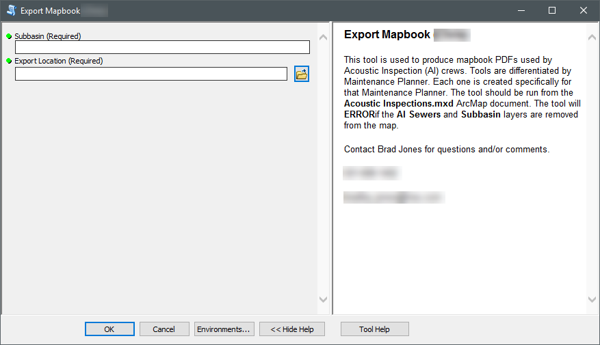
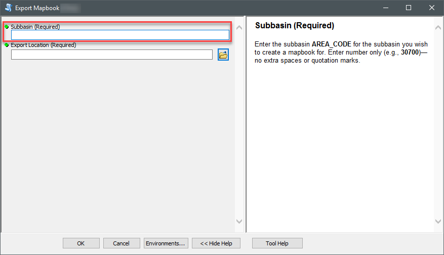
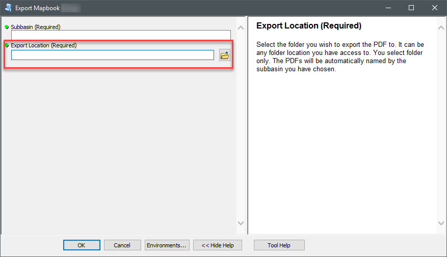

---

---

# Inspection-Map-Export

A geoprocessing tool that is used to export a pdf map series for a designated subbasin number.

Used by supervisors to supply inspection crews with map of assigned subbasin.

Parameter 1: Subbasin number

Parameter 2: Destination directory for exported pdf

*ArcGIS For Desktop 10.5*

*Python 2.75*

**Geoprocessing Tool Dialog**

